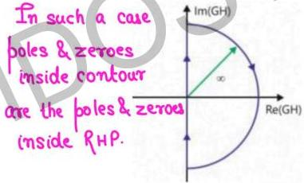

# Type of Nyquist Contour

To judge stability, we need to determine no. of poles in RHP so the Nyquist contour in the s-plane must encircle the entire right half plane. Must not pass through any pole.

