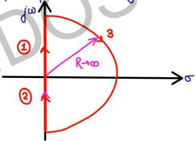

phase cross over freq.

$$\phi = -180$$

$$-180 = -180 + \tan^{-1} \omega + \tan^{-1} \omega / 2$$
$$- \tan^{-1} 2\omega$$

$$\tan^{-1} \left( \frac{\omega + \omega / 2}{1 - \omega^2 / 2} \right) = \tan^{-1} 2\omega$$

$$\frac{3\omega}{2 - \omega^2} = 2\phi$$

$$3 = 4 - 2\omega^2$$

$$2\omega^2 = 1$$

$$\omega = 1/\sqrt{2}$$

Since $$\omega =$$ finite for $$\phi = -180^\circ$$

$$\therefore$$ polar plot cuts $$-180^\circ$$ axis

no poles of $$G(s)H(s)$$ at origin