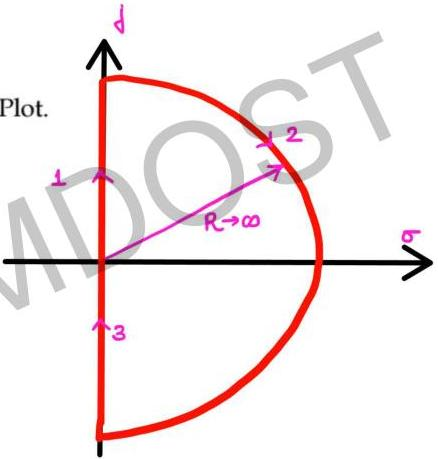

# Question-03

$$T(s) = \frac{1}{(1+ST_1)(1+ST_2)}$$ Draw Nyquist Plot.

$$T(\jmath\omega) = \frac{1}{(1+\jmath\omega T_1)(1+\jmath\omega T_2)}$$

polar plot is already known.

∴ there is no pole at origin

∴ no need to bypass origin in Nyquist contour.