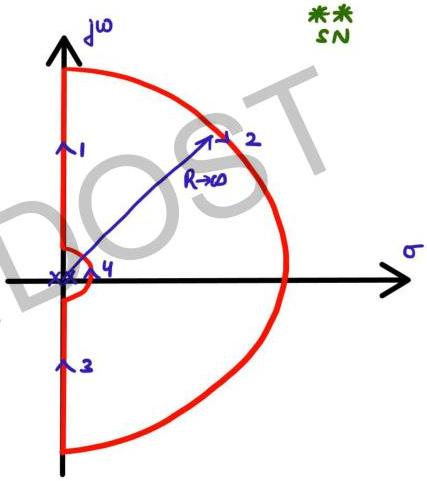

# Question-04

Type-2

nyquist plot will

contain 2 ∞ sc

or 1 ∞ circle

Draw the Nyquist Plot for the function

$$G(s)H(s) = \frac{1}{s^2}$$

$$GH(j\omega) = \frac{1}{(j\omega)^2} = 1/\omega^2 \angle -180^\circ$$

polar plot is already known

2 poles at origin ∴ we must
by pass origin in Nyquist
contour.

